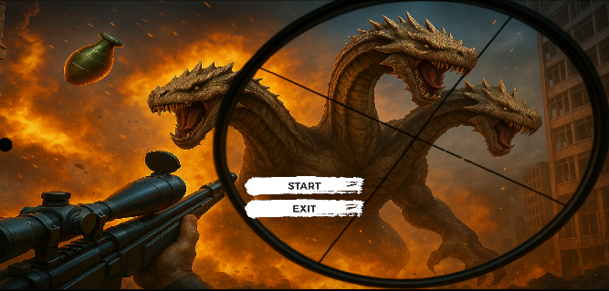
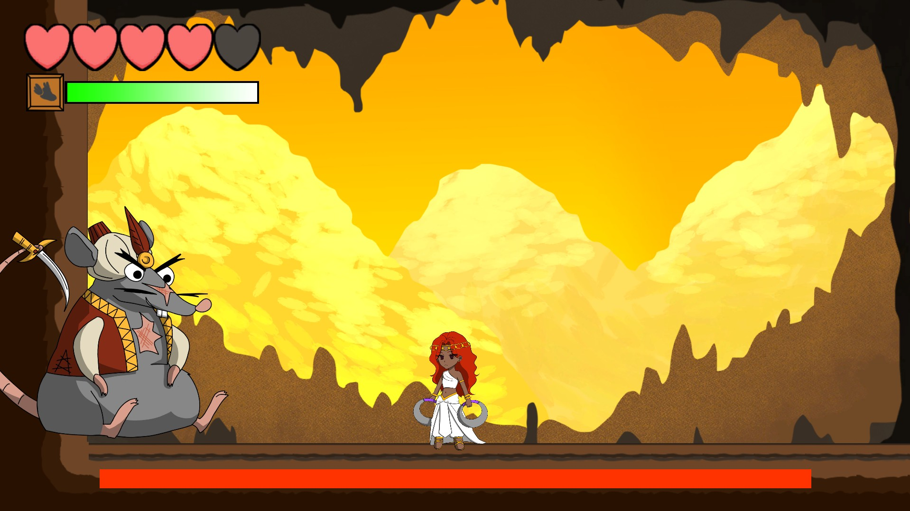
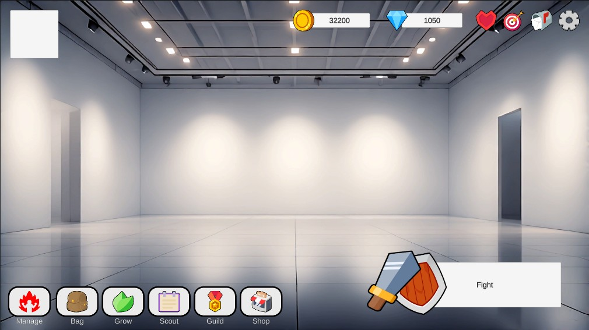
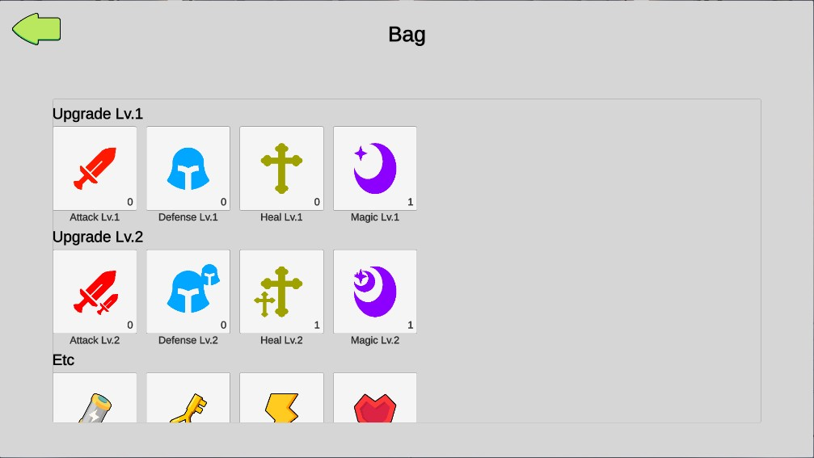
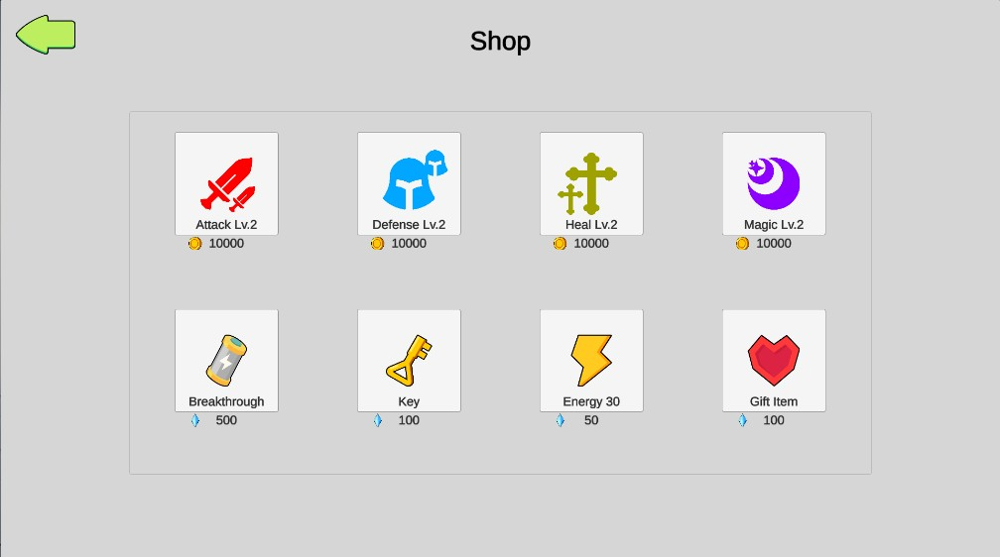
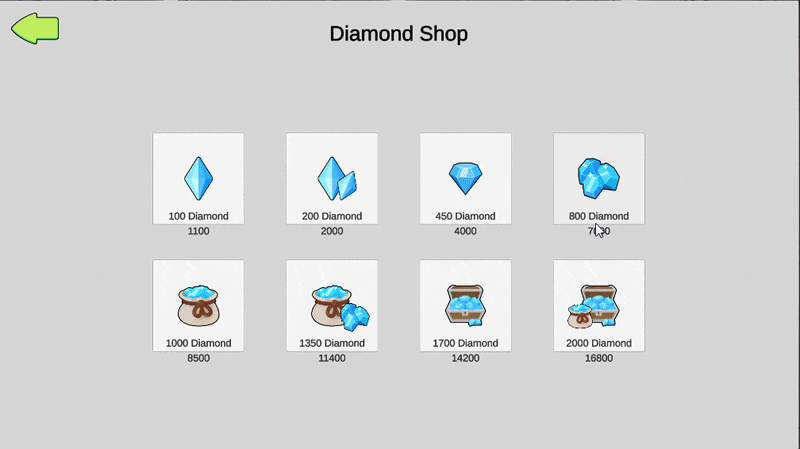

# Portfolio_Unity

포트폴리오에 사용된 프로젝트들의 코드들을 모아놓은 레포지토리입니다.

# Unity Game Developer Portfolio

안녕하세요. Unity 기반으로 클라이언트 개발을 연습하고 있는 개발자 **이창희**입니다.  
FPS, 메트로배니아, 플랫포머, 수집형RPG(UI) 등 여러 장르의 프로토타입을 Unity로 구현해 보며 개발 경험을 쌓고 있습니다.

- **목표 포지션**: Unity 클라이언트 프로그래머  
- **E-mail**: `llch1026@naver.com`  
- **GitHub**: (https://github.com/sproutedpotato/)

---

## 🛠 Tech Stack

**Engine & Language**
- Unity (2D/3D)
- C#
- Python
- Vibe coding

**Gameplay**
- FPS, 2D 메트로배니아, 플랫포머
- 수집형 RPG외 다른 게임에도 활용 가능한 UI

**System**
- FSM 기반 플레이어와 몬스터 상태 관리
- 가챠(뽑기), 인벤토리, 상점, 재화 구매, 캐릭터 관리 시스템

**기타**
- SQL을 활용한 SQLite DB 사용
- AI를 활용하여 생산성을 높이는 바이브코딩 가능

---

## Projects

### 1. Void Hunter - AR기반의 1인칭 FPS게임
- **구분**: 한밭대학교 캡스톤 디자인 프로젝트
- **역할**: Unity 3인 개발 (기획 1, 개발 2)
- **담당**: 플레이어 및 몬스터 기능 구현 담당
- **핵심 기능**
  - Fire Point로부터 발사되는 총알, 연발 및 단발 기능
  - FSM상태 머신을 통한 플레이어 상태 관리
  - FSM상태 머신을 통한 몬스터 상태 관리
  - AR과 유니티 연동
 
    
- **고민한 점 & 배운 점**
  - **[거리 기반 삭제 처리 및 한계점 파악]**
    거대한 맵에 수많은 오브젝트와 몬스터가 쌓이면서 CPU 프레임 드랍이 발생했습니다.
    우선 프레임 유지를 위해 플레이어와 일정 거리 이상 멀어진 오브젝트를 Destroy로 즉시 삭제 처리하여 연산 과부하를 줄였습니다.
    이후 이 방식을 사용하면 프레임은 확보되지만, 런타임 중 동적 생성(Instantiate)과 파괴(Destroy)가 반복되어
    메모리 가비지(GC Alloc)가 발생하는 한계점도 함께 배울 수 있었습니다.
  -**[에셋 구조 개선 및 부위별 판정 구축]**
    사용한 3D 에셋이 부위별 히트박스를 지원하지 않아, FPS 장르에 필수적인 헤드샷 및 부위별 차등 데미지 구현에 한계가 있었습니다.
    이를 해결하기 위해 몬스터의 주요 뼈대(Bone) 구조를 분석하고 머리, 몸통, 팔, 다리에 Capsule Collider를 직접 하나씩 배치하여 레이어(Layer)로 세분화했습니다.
    이 작업을 통해 에셋 한계를 극복하고 정밀한 부위별 Raycast 판정 시스템을 구축할 수 있었습니다.
  -**[소규모 팀 협업 및 스케줄 관리]**
    캡스톤 제출 마감이 임박했을 때 밤을 새우며 급하게 개발을 진행한 적이 있습니다.
    피로가 쌓인 상태에서 작업하다 보니 집중력이 떨어져 단순한 버그를 찾는 데 긴 시간을 허비하거나,
    정작 중요한 기능보다 부수적인 기능을 먼저 건드리는 시행착오를 겪었습니다.
    이 경험을 통해 진짜 중요한 핵심 기능부터 차근차근 개발하는 순서 정하기와, 팀원 전체의 컨디션 관리 또한 프로젝트 완성을 위한 중요한 실력임을 깨달았습니다.

---

### 2. Scheherazade - 천일야화의 이야기를 담은 2D 메트로배니아 게임
- **구분**: 대전정보문화산업진흥원 인디게임 개발 스쿨 프로젝트
- **역할**: Unity 6인 개발 (기획 + 아트 1, 개발 3, 아트 2)
- **담당**: 플레이어 기능 구현 / 몬스터 기능 구현 / 일부 UI 기능 구현 / 스토리 연출 / 레벨 디자인
- **핵심 기능**
  - 대시 무적, Coroutine 이동 및 이벤트 기반 플레이어 상태 제어
  - 공격 및 발판 역할을 겸하는 차크람 기믹
  - 스테이지를 클리어 할 때마다 진행되는 스토리
  - 천일야화 이야기의 컨셉을 살린 몬스터와 보스
 
 
 
 
 
    
- **고민한 점 & 배운 점**
  - [LayerMask 및 ContactFilter2D를 활용한 충돌/발판 판정]
    플레이어가 던진 '차크람'이 공격용 투사체이면서 동시에 밟고 올라서야 하는 발판 역할을 겸하다 보니, 피격 판정과 지형 충돌이 서로 엉키는 문제가 있었습니다.
    이를 해결하기 위해 필터 및 레이어 마스크를 설정하고 콜라이더 감지를 활용해 몬스터 공격 레이어와
    지형(발판) 레이어를 명확히 분리함으로써 상호작용 충돌을 깔끔하게 해결했습니다.
  -[타일 팔레트 도입을 통한 생산성 개선]
    초기에는 맵 오브젝트를 개별 드래그 앤 드롭 방식으로 배치하여 맵 수정이 어렵고 작업 시간이 오래 걸렸습니다.
    이를 개선하기 위해 Tile Palette 시스템을 구조화하여 도입했고,
    반복 작업을 자동화하면서 레벨 디자인 작업 속도를 이전 대비 약 2배 이상 향상시키는 성과를 거두었습니다.
  -[단일 클래스 비대화 문제 파악 및 아키텍처 개선에 대한 회고]
    마감 기한에 맞춰 빠르게 개발을 진행하다 보니,
    PlayerController 하나에 이동, 점프, 공격, 대시, UI, 사운드, 씬 전환, 가챠 확률 로직(getItemNum)까지 모두 모여
    단일 책임 원칙(SRP)이 깨지고 코드 결합도가 높아지는 한계를 경험했습니다.
    이 경험을 통해 초기 클래스 설계와 역할 분리(플레이어 조작, 플레이어 스탯, 아이템 획득 로직 등)의 중요성을 절감했고,
    차기 프로젝트에서는 FSM(상태 머신) 패턴과 데이터 분리 구조를 적극 도입하는 계기가 되었습니다.

### 3. Front_UI - 수집형 RPG의 가챠, 강화, 인벤토리 등 게임의 핵심 비즈니스 로직과 SQLite 기반 데이터 관리 시스템 구축
- **구분**: 개인 프로젝트
- **역할**: Unity 1인 개발
- **핵심 기능**
  - 재화 구매 / 아이템 구매
  - 캐릭터 뽑기(가챠) / 캐릭터 강화 / 캐릭터 관리
  - UI 설정, 프로필 관리
  - SQLite를 통한 플레이어 정보 관리
 
 
 
 
- **고민한 점 & 배운 점**
  -[가중치 랜덤 알고리즘 기반 가챠 시스템 구현]
    단순 단순 난수(Random.Range) 방식의 한계를 극복하고자 각 아이템 등급에 가중치(Weight)를 부여하고,
    누적 가중치 합 범위 내에서 난수를 판정하는 가중치 랜덤 알고리즘을 구현했습니다. 이를 통해 기획 의도에 맞춘 정밀한 확률 제어 구조를 갖추었습니다.
  -[PlayerPrefs 탈피 및 SQLite 로컬 DB 구축]
    인벤토리, 카드 스탯 등 복잡하고 많은 양의 유저 데이터를 관리하기 위해 기존 키-값 형태의 PlayerPrefs 대신 관계형 데이터베이스인 SQLite를 유니티에 연동했습니다.
    정보처리기사에서 학습한 DB 지식을 실무에 접목해 복잡한 데이터 조회 및 추후 확장성(길드, 친구 데이터 등)을 고려한 구조를 설계했습니다.
  -[동적 리소스 로딩 및 아키텍처에 대한 회고]
    인스펙터 직접 할당 방식의 한계를 인지하여, DB에는 에셋 ID값만 저장하고 실행 시 동적 로딩(Resources / Addressables)하는 구조로의 리팩토링 필요성을 깨달았습니다.
    또한 UI 패널과 데이터 간 높은 결합도를 해소하기 위해 Observer 패턴을 활용한 중앙 데이터 매니저 구조의 가치를 정리하는 계기가 되었습니다.

### 4. Pixel Adventure - 플레이어의 트로피를 찾는 여
- **구분**: 개인 프로젝트
- **역할**: Unity 1인 개발
- **핵심 기능**
  - 원활한 조작감 : 이동, 점프
  - 적대적 유닛과 함정 및 체력 회복용 과일
  - Cinemachine을 통한 부드러운 카메라 움직임
 
 
 
    
- **고민한 점 & 배운 점**
  -[물리 엔진 의존성 탈피를 통한 조작감 개선]
    이전 프로젝트에서 경험한 Rigidbody 기본 물리의 미끄러짐과 둔한 조작감을 개선하고자 중력 가속도와 점프 공식을 직접 스크립트로 구현했습니다.
    이를 통해 의도한 타이밍에 정확하게 반응하는 경쾌한 2D 플랫포머 조작감을 완성했습니다.
  -[다중 콜라이더 구조 단순화 및 물리 쿼리 최적화]
    오브젝트에 여러 개의 Collider를 부착해 상태를 체크하던 기존 방식의 비효율성을 개선하기 위해,
    단일 Collider와 OverlapAll 등 유니티 물리 쿼리(Physics Query)를 조합했습니다. 결과적으로 콜라이더 관리 복잡도를 크게 낮추고 유지보수성을 확보했습니다.
  -[설계 문서화와 기술 부채에 대한 깨달음]
    "나중에 리팩토링하면 되겠지"라는 안일한 구현이 결국 코드 결합도를 높이고 기술 부채로 돌아온다는 점을 체감했습니다.
    이를 계기로 개발 전 클래스 간 의존성과 응집도를 고려한 설계 문서화의 필수성을 깊이 깨달았습니다.

